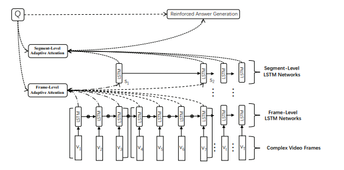
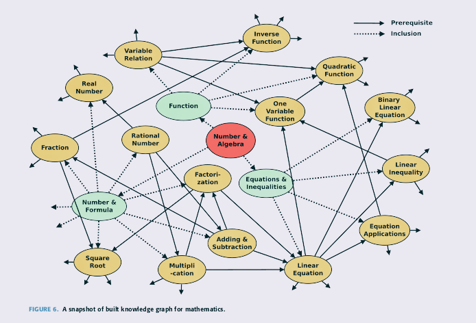

# Implementing the Knowledge Ecosystem

In this section, we set out to answer the following question: 

> How might we approach designing such a knowledge ecosystem?

We will take a tour through a relevant set of implementations of the elements within the proposed knowledge ecosystem. We will present the relevant research in machine learning for each of the elements and also propose a new artificial neural network architecture, Educational Content to Question Answer (EC2QA) network, with the details needed to design such a network.

## Problem Formulation

Building such a knowledge ecosystem is not a trivial task. A necessary step of searching for the proper solutions would be trying to break the whole system into independent elements that we can deal with separately. As we discussed earlier, we've divided the ecosystem into the elements below:

1. **Learning + Feedback [EC2QA]** -- given a learner views a single educational content, reliably evaluate their knowledge and provide feedback for improvement to support learning (credibility, rigour) 

2. **Knowledge Graph** --  relate any educational content to a concept which belongs to a particular subject, (relatibility, predictability)

3. **Knowledge Journeys** -- given educational content, a learner's score on such content, and history of  viewing and testing, use the knowledge graph to map the learner's journey over time, offer a way for a learner to compare, connect with, and follow another's journey (compare, traverse)

4. **Knowledge Footprint** -- given a learner's journey, collapse it into a representative symbol(s) (relatibility, stable but evolving system )

Much of element two (#2) and element one (#1) are possible with the recent breakthroughs in the machine learning subfield, deep learning. Elements three (#3) and (#4) may require a different approach to tie the other elements together and there isn’t a solution that ties each of the elements together to our knowledge. We see #3 and #4 as design problems to be approached from the bottom up. In this section we will focus on the first two (#1 & #2) elements. 

### Before we start...

As discussed above, recent trends in deep learning have produced state-of-art results on relevant tasks that we will cover below. 

 To best illustrate the problem and possible solutions, to simplify our examples we will focus solely on educational videos (Youtube or how-to videos). Keep in mind that our ultimate goal is to apply our approach to any type of online educational content including open texts, digital texts, audio or podcasts.
 
Let us now explore some of the recent results that would enable us to design the first two (#1 & #2) elements of our ecosystem.

## Learning + Feedback [EC2QA]

### Question Formulation

In short, in this section we will be providing some insights on how to solve the following puzzle: 

 >"how can we take a single educational content and properly test a learner's knowledge while also providing insightful feedback to support their learning?". 

### The Approach

We consider learning + feedback as a key component of the ecosystem which would settle our concerns with the issues of passive knowledge consumption and untested knowledge.

Based on the above concerns we'll take a novel approach to ensure that our learning + feedback element can do the following:

1. Generate a set of questions and answers for any educational content (Domain: Question and Answer Generation)

2. Evaluate closed and open ended answers (Domain: Answer Evaluation)

3. Provide a score for the content based on the learner's performance (Domain: Aggregate scoring)
 
 
The ideal result is to provide a learner with a credible picture of their tested knowledge and an interactive learning experience that best support their knowledge acquisition. 
 
We will now explore some current research trends in deep learning that will help us solve the problem.

In previous years, deep learning research has taken up a similar problem titled Question Generation (QG) and Question Answering (QA). 
 
### Question & Answer Generation
 
Question Generation (QG) was originally part of NLP. The goal of QG is to generate questions according to some given information. It could be used in many different scenarios i.e. generating questions for reading comprehension, generating data from large scale question-answering pairs or even generating questions from images. Earlier approaches to QG mainly used human-crafted rules and patterns to transform a descriptive sentence to a related question. Recent neural network-based approaches represent the state-of-art of most of those tasks and these approaches have been successfully used to solve many other NLP tasks i.e. neural machine translation, summarization, etc. As the training optimization studies progress, the stability and performance improvements are guaranteed. 
 
 
As for Question Answering (QA) task, it is one of the most popular research domain in NLP as well. Recently, QA has also been used to develop dialog systems and chatbots designed to simulate human conversation. Traditionally, most of the research used a pipeline of conventional linguistically-based NLP techniques i.e. parsing, part-of-speech tagging and coreference resolution. However, with recent advancements of deep learning, neural network models have shown promise for QA. Further improvements i.e.attention mechanism and memory networks allow the network to focus on the most relevant facts such that they can reach the new state-of-art performance for QA.

Now we have some basic understanding of these 2 tasks for which we will be expanding more in depth later. Consider the next question: 

>"what types of questions & answers would be best to test a learner's knowledge given a piece of educational content (i.e. a lecture video)"

Let's say a learner is watching a video about hypothesis testing, midway through the video the educator shows an example and provides the data needed to test the hypothesis. It would be very beneficial for a learner if during this time his/her knowledge is tested with the following possible questions: 

1. What is the definition of the p-value? (and provide multiple choices for learner to choose from)

2. Is this a 1-sided test? (answers provided would be: YES or NO)

3. How would you interpret the p-value in the context of this example.

4. What is the difference between null hypothesis and alternative hypothesis based on the previous comparison?

5. Give me a quick summary about what you have learned through this video or this example.  (It is also helpful to ask learner the question like this after showing the solution)

As shown above, we would call questions #1 and #2 the close-ended questions; question #3 and #4 the specific open-ended questions; and question #5 a general open-ended question.

Based the above information, we can update our question formulation into:

1. Generate close-ended question + answers pairs

2. Generate specific open-ended question + answers pairs

3. Evaluate and comment on the general open-ended answers 

In terms of the close-ended questions, the answers can be well defined and evaluated. However, the process might be a little bit tricky when it comes to the open-ended ones. We will approach each of them here from the current research perspective.  

#### Why deep learning? 

As we stated above, deep learning has achieved state-of-art performance in both QG and QA tasks. But how? 

If you pay close attention to the QG and QA type of problems, you can easily reframe the problem into a general machine learning problem in which the model needs to learn the relationship between the input (educational content) and the output (meaningful question & answer pairs) that is associated with the content. In other words, our prolem could be simplified as provide the needed data for the model to learn a function that capture the relationship between our input and output, or, appropriately map the educational content to the desired question and answer pairs. 

To the best of our knowledge, deep learning is one of the most optimal techniques currently developed to learn such complex representations of complex data such as video lectures. 

By definition, machine learning is subfield of Artificial Intelligence that uses statistical learning techniques to give the machine the ability to learn from the data. It explores the algorithms that can be used to parse data, learn from the data, and then apply what they have learned to make inference. While deep learning is a subset of machine learning that belongs to the family of representation learning. Inside this family, deep learning is particularly good at sampling the features and having additional layers for more abstract feature learning. All of these special properties are crucial for our goal. 

Moreover, deep learning is known as one of the most flexible machine learning algorithms that can learn and map a **deep representation** of supervised concepts within the data. Deep neural network architecture can be composed into a single differentiable function and trained end-to-end until it converges. As a result, they can help identify the suitable *inductive* *biases* catered to the training data. 

Specifically, deep learning outperforms other techniques when the training data is large and the advantage fits our situation well. In our case, we could easily find a large amount of educational content available on the web.

The large amount content creates another problem that can be avoided with deep learning, which is it's going to be very troublesome if you plan to do feature engineering manually. When there is lack of domain understanding for feature introspection, deep learning is preferable. 

In the end, deep learning really shines when it comes to many specialized research problems such as NLP, Visual Recognition and Speech recognition. For creating our ecosyestem, all those domains will possibly be involved. 

### Question Generation

Let's begin with question generation (QG) task. 

The ideal goal of an automatic question generation is to generate a question Q that is syntactically and semantically correct, relevant to the context and meaningful to answer. 

In order to achieve this goal,, we need to train an algorithm to learn the underlying conditional probability distribution

$$P_{\theta}(Q|X)$$

parametrized by $\theta$. In other words, we can think of this problem as the one that requires the model to learn a function (with a set of parameters) $\theta$ during the training stage using content-question and/or answer sets so that the probability/likelihood $P_{\theta}(Q|P)$ is maximized over the given training dataset. 

We can also think of this problem as a typical seq2seq (sequence-to-sequence) learning problem since both the input and the output are a sequence of text character that the model needs to process and learn from. 

#### Case Studies

1. In this paper [QG-Net: A Data-Driven Question Generation Model for Educational Content](http://www.princeton.edu/~shitingl/papers/18l@s-qgen.pdf). They use a bi-directional LSTM network to process the input context words sequence. Encoding the answer into context word vectors.

QG-Net generates questions by iteratively sampling question words from the conditional probability distribution $$P(Q|C,A,\theta)$$ where $\theta$ denotes a set of parameters. In order to construct the probability distribution, they first create a **context reader** that process each word $c_j$ in the input context and turns it into a fix-sized representation $h_j$

Meanwhile, they also have a **question generator** generates the question text word-by-word, given all context word representation and all question words in previous time steps. 

As for the quantitative evaluation, they aim to minimize the difference between the generated question and the true question in the training set during training. They use the standard back-propagation through time with the mini-batch stochastic gradient descent algorithm to learn the model parameters. To ensure the performance, they employ *teacher forcing* procedure for training the LSTMs and they implement beam search, a greedy but effective approximation, to exhaustively search and select the top 25 candidate output question sentences. The final one would be the one with the lowest negative log likelihood. 

The high-level QG-Net architecture is as below: 

2. In this paper [TOPIC-BASED QUESTION GENERATION](https://openreview.net/pdf?id=rk3pnae0b), they propose a topic-based question generation algorithm. The algorithm is able to take in a input sentence, a topic and a question type and generate a word sequence related to the topic, question type and the input sentence. 

They formulate a conditional likelihood objective function as mentioned before to the model to learn. 

Also, they go through a few general frameworks that have been employed for solving the similar problem.

* The first one is *seq2seq model* that uses a bidirectional LSTM as the encoder to encode a sentence and a LSTM RNN (Recurrent Neural Network) as the decoder to generate the target question. 
 
* The second approach is *question pattern prediction and question topic selection algorithms*. It takes in an automatically selected phrase Q and fill this phrase into the pattern that was predicted from pre-mined patterns.

* The last approach is *multi-source seq2seq learning* which aims to integrate information from multiple sources to boost learning. 

3. In this paper [A Framework for Automatic Question Generation from Text using Deep Reinforcement Learning](https://arxiv.org/pdf/1808.04961.pdf), they implement a reinforcement learning(RF) framework that consists of a generator and an evaluator for this task. 

They refer to *the generator* part of the model as the $agent$ and the $action$ of the agent is to generate the next work in the question. The probability of decoding a word is $$P_{\theta}(word)$$ with a stochastic policy. 

*The evaluator* part of the model will in turn assign a $reward$ for the output sequence predicted using the current $policy$ by the generator. Based on the reward assigned by the evaluator, the generator updates and improves its current policy. In short, the goal in RL-based question generation is to find a policy that can maximize the sum of the *expected return* at the end of the sequence generation. 

#### Summary 

In this QG section, we have discussed 3 different algorithms. Based on our learning, we can conclude that a generative seq2seq model might be a suggested model for this task. As for our objective function, we should be foumulating a conditional probability distribution that is conditioned on the provided content  (i.e. the video) and answers. As suggested, we can use a bi-directional LSTM RNN as the encoder to encode the content and use a LSTM RNN as the decoder to generate the question. 

### Question Answering 
Now, let's move on to our question answering (QA) task. The general goal of a QA model is to predict an answer to a question based on the information found in the passage, given a passage and a question. By solving this task, our system should be able to easily evaluate the answer provided by learners and achieve the full automation of the learning + feedback cycle.

Here are the overview of a basic QA model's [implementation](@qa_imp): 

1. Build representation for the passage and the question separately;

2. Incorporate the question information into the passage;

3. Get the final representation of the passage by directly matching it against itself;

4. Generate the answer.

And the typical mechanims applied for solving such a problem include: 

* Embedding 

* Encoder Decoder 

* Attention Mechanism 

#### Close-ended Questions

##### Visual Question Answering (VQA)

VQA is a challenging research problem that focuses on providing a natural language answer given any image and any free-form natural language question. As we are managing to handle the video educational content first, our problem will include both NLP and visual recognition tasks. Therefore, VQA should be a great area to start with. 

###### Case Studies

1. In this paper [Deep Attention Neural Tensor Network for Visual Question Answering](http://openaccess.thecvf.com/content_ECCV_2018/papers/Yalong_Bai_Deep_Attention_Neural_ECCV_2018_paper.pdf), they propose a novel *deep attention neural tensor network* that can discover the joint correlation over images, questions and answers with tensor-based representation. 

As for their workflow, they model one of the pairwise interaction (i.e. between image and question) by **bilinear features**, which is further encoded with the third dimension (i.e. answer) to be a triplet using bilinear tensor product. During this step, the model takes in a question + a corresponding image + candidate answers as the input. A CNN (convolutional neural network) a GRU RNN are used for extracting feature vectors and question respectively. Then the representation is passed on as a *multi-modal feature* and integrated by a **bilinear pooling** module. Moreover, they decompose the correlation of triplets by their question and answer types with a **slice-wise attention module** on tensor to select the most discriminative reasoning process inference. 

In the end, they optimize the proposed network by learning a label regression with KL-divergence losses. They claime that these techniques enable them to do scalable training and fast convergence over a large number of answer set. During the inference stage, they feed the embeddings of all candidate answer into the network and then select the answer which has the biggest triplet relevance score as the final answer. 

The high-level network architecture is as follows: 

2. In this paper [Question Type Guided Attention in Visual Question Answering](https://arxiv.org/pdf/1804.02088.pdf), they propose a model called **Question Type-guided Attention (QTA)**. This model utilizes the information of question type to dynamically balance visual features from both top-down and bottom-up orders. 

Also, they propose a *multi-task extension* that is trained to predict question types from the lexical inputs during training which generalizes the network into applications that lack question type, with a minimal performance loss. 

As for their main contribution, they focus on developing an attention mechanism that can exploit high-level semantic information on the question type to guide the visual encoding process. 

Specifically, they introduce a novel VQA architecture that can dynamically gate the contribution of ResNet and Faster R-CNN features based on the question type. In turn, it allows them to integrate the information from multiple visual sources and obtain gains across all question types. 

3. In this paper [Multi-Turn Video Question Answering via Multi-Stream Hierarchical Attention Context Network](https://www.ijcai.org/proceedings/2018/0513.pdf), they propose a hierarchical attention context network for context-aware question understanding by modeling the hierarchically sequential conversation context structure. They incorporate the multi-step reasoning process into **the multi-stream hierarchical attention context network** to enable the progressive joint representation learning of the multi-stream attentional video and context-aware question embedding. 

To construct their dataset, they collect the conversational video question answering datasets from [YouTubeClips](http://upplysingaoflun.ecn.purdue.edu/~yu239/) and [TACoS-MultiLevel](https://www.mpi-inf.mpg.de/departments/computer-vision-and-multimodal-computing/research/vision-and-language/tacos-multi-level-corpus/). The first dataset has 1987 videos and the second dataset has 1303 videos. They invite 5 pairs of crowd-sourcing workers to construct 5 different conversational dialogs. In total, they have collected 37228 video question answering pairs for TACoS-MultiLevel data and 66806 ones for YouTubeClips data. 

4. In this paper [MovieQA: Understanding Stories in Movies through Question-Answering](https://arxiv.org/pdf/1512.02902.pdf), they construct a new dataset ** MovieQA** dataset that can be used to evaluate automatic story comprehension from both video and text.  

They collect 408 subtitled movies and obtained their extended summaries in the form of **plot synopses**(movie summaries that fans write after watching the movie) from Wikipedia. They used plot synopses as a proxy for the movie. They have annotators create both quizzes and answers pairs by referring to the story plot. Time-stamp is also attached with each question and answer pair. 

In the second step of data collection, they used the multiple-choice answers and question collected as the input to show to a different group of annotators. By doing so, annotators could re-formulate the question and answers for the sanity check. 

##### Summary
By going through the previous examples, we can see that VQA and few similar algorithms introduced before are designed to efficiently process image and text input data while making the inference based on the input.

Few main insights learned through the research. First, key components for creating and trainnig a VQA model such as feature selection, feature pooling and specifically designed attention mechanism. The input of the mode is typically a video clip + question + answer pairs. A CNN and sometimes a RNN is needed for such a task. 

Another important learning is that we can follow the steps they take to collect and annotate our training data by asking crowd-sourcing workers to construct the question and answer pairs. Also, more advanced algorithm like the one described above multi-stream hierarchical attention context network is in need for dealing with video input data in contrast to static pictures. 

##### Dual Question-Answering Model

Both Question Generaion(QG) and Question Answering(QA) are well-defined 2 sets of problems that aim to either infer a question or an answer given the counterpart based on the context. However, they are usually explored separately despite of their intrinsic complementary relationship. In our case, a system needs to take on both roles simultaneously.

Let's look into a few algorithms are designed for this. 

###### Case Studies

1.In this paper [Dual Ask-Answer Network for Machine Reading Comprehension](https://arxiv.org/pdf/1809.01997.pdf), they present a model that can learn question answering and question generation simultaneously. They tie the network components that playing the similar roles into 2 tasks to transfer cross-task knowledge during training. 

Then *the cross-modal interaction* of question, context and answer is captured with a pair of **symmetric hierarchical attention** processes. 

The high-level architecture of the model is illustrated as below: 

In short, the model is composed of the following components: embedding layer, encoding layer, attention layer and output layer. The model is fed with a question-context-answer triplet $(Q,C,A)$ and the decoded Q and A from the output layer. Their loss function consists of 2 parts: 

- negative log-likelihood loss 
- a coverage loss to penalize repetition of the generated text

2. In this paper [Harvesting Paragraph-Level Question-Answer Pairs from Wikipedia](https://arxiv.org/pdf/1805.05942.pdf), they apply their question-answer pair generation system to 10000 top-ranking Wikipedia articles and create over a million question-answer pairs. 

In their task formulation part, they clarify that they break this task into 2 sub-tasks: 

- candidate answer extraction 
- answer-specific question generation 

To complete the tasks, they first identify a set of question-worthy candidate answer set $ans = (A1, A2,...Ai)$. For each candidate answer $A_i$, they then aim to generate a question $Q$ -a sequence of tokens ${y1,y2,...yn}$ - based on the sentence S that contains candidate $A_i$ such that 
- Q asks about an aspect of $A_i$ (of potential interest to a human) 
- Q might rely on information from sentences that precedes S in the paragraph. Mathematically, they compose a function $$Q = argmax_Q P(Q|S,C)$$.

3. In this paper [Visual Question Generation as Dual Task of Visual Question Answering](http://cvboy.com/pdf/publications/cvpr2018_iqan.pdf), they propose an end-to-end unified model, **Invertible Question Answering (iQAN)** to introduce question generation as a dual task of question answering to improve VQA performance. 

In achieving their goal, they leverage the **dual learning** framework that is proposed in machine translation area initially, which uses $A-to-B$ and $B-to-A$ translation models to form two closed translation loops and let them teach each other through a *reinforcement learning process*. 

In their VQA component, given a question $q$, an RNN is used for obtaining the embedded feature **q**, and CNN is used to transform the input image $v$ into a feature map. A *MUTAN-based attention module* is then used to generate a question-aware visual feature $v_q$ from the image and the question. Later, another *MUTAN fusion module* is used for obtaining the answer feature $a\hat{}$

4. In this paper [A Unified Query-based Generative Model for Question Generation and Question Answering](https://arxiv.org/pdf/1709.01058.pdf), they propose a query-based generative model for solving both tasks. The model follows the classic *encoder-decoder* framework. The **multi-perspective matching encoder** that they are implementing is a bi-directional LSTM RNN model that takes a passage and a query as input and perform query understanding by matching it with the passage from multiple perspectives; 

The decoder is an **attention-based LSTM RNN** model with *copy and coverage* mechanism. In the QG task, a question will be generated from the model given the passage and the target answer; whereas in the QA task, the answer will be generated given the question and the passage. 

They also leverage a *policy-gradient reinforcement learning* algorithm to overcome *exposure bias* (a major problem resulted from sequence learning with cross-entropy loss function).

They case both QG and QA tasks into one process by firstly matching the input passage against the query, then generating the output based on the matching results. 

As for the training, they first pretrain the model with cross-entropy loss and then they fine tune the model parameters with policy-gradient reinforcement learning to alleviate the exposure bias problem. They end up adopting a similar sampling strategy as the scheduled sampling strategy for generating the sampled output during the reinforcement learning process.

##### Summary 
 As mentioned earlier, QG and QA tasks are intrinsically bounded and one cannot find solution for either of them without taking the other party into account. 
 
 In this section, we have discussed some approaches that many groups of people have taken to help machine operate on both tasks simultaneously. Some exciting findings have been presented here. 
 
For our problem, it is very motivating to see these progress and learn from their approaches. In sum, our general setup is similar to dual learning framework, we need to tie QG and QA part of the algorithms together. In the first diagram of the section, we can see that they connect the loss function from both sides of the model and it is very similar to the strategy adopted by [GAN](https://en.wikipedia.org/wiki/Generative_adversarial_network) (Generative adversarial network). Some advanced mechanisms are proposed as well for effectively solving these tasks i.e. symmetric hierarchical attention and policy-gradient reinforcement learning algorithm. 

#### Open-ended Question 

##### Problem Formulation 

> Open-ended questions bring clarity.

As we mentioned above, the open-ended question could be roughly split into 2 categories. A general open-ended question or a specific open-ended question.

Technically specking, these 2 categories are not that particular distinct since both problems require the system to draw some conclusion based on the context and question provided; As for the answer, it is allowed to have a pretty high degree of freedom. Therefore, our system should be able to evaluate the answer with relatively flexible rules or standards. 

Based our assumptions, we will combine these 2 problems into 1 for now for our further investigation. 

It may appear unapproachable at the first glance to teach a system to have answers for or evaluate this type of problems. Again, we need to reframe our problem and then break it apart.

Based on our research, we believe it is helpful to think of this type of issue as a particular type of QA problem; the difference is that after the QA procedure, we need to match and evaluate the answers generated by machine and the learner such that we can provide an adequate evaluation.  

Let's start by looking at an existing knowledge evaluation system that has been used for grading the essays automatically - **Automated essay scoring (AES)**. AES focuses on automatically analyzing the quality and assigning a score of a piece of writing . AES systems could rely not only on grammars, but also on more complex features such as semantics, discourse and pragmatics. It has four general types: 

* Essay Grade:  it is known as the first AES system.

* Intelligent Essay Assessor: it is using Latent Semantic Analysis features

* E-rater: it has been used by the ETS to score essay portion of GMAT

* IntelliMetric: it is developed and used by the College Board for placement purposes.

Below are some research findings we consider as useful for our unified goal. 

###### Case Studies  

1. In this paper [Neural Automated Essay Scoring and Coherence Modeling for Adversarially Crafted Input](http://aclweb.org/anthology/N18-1024), they develop a network that can effectively learn connectedness features between sentences and propose a framework for integrating and jointly training the local coherence model with a state-of-art AES. 

They examine the robustness of the AES model on adversarially crafted input and specifically focus on input related to local coherence; A local coherence model can evaluate the writing based on its ability to rank coherently ordered sequence of sentences higher than their counterparts. 

The models they used are *Local Coherence (LC)* model and LSTM AES model. The first model has 2 main parts: sentence representation and clique representation; and he second model is a combined model that does vector concatenation and joint learning.

2. In this paper [Open-Ended Long-form Video Question Answering via Adaptive Hierarchical Reinforced Networks](https://www.ijcai.org/proceedings/2018/0512.pdf), they study the problem of open-ended video question answering from the viewpoint of the *adaptive hierarchical reinforced encoder-decoder network* learning. 

They present the adaptive hierarchical encoder network to learn the joint representation of the long-form video contents according to the question with adaptive video segmentation. They also develop the reinforced decoder network to generate the neural language answer for open-ended video question answering. Meanwhile, they construct a large-scale dataset for open-ended long-form video QA and validate the effectiveness of the proposed method. 

The framework of **Adaptive Hierarchical Reinforced Networks** is are below: 

The first part of the model is the hierarchical encoder networks that learn the joint representation of multimodal attentional video and textual question with adaptive video segmentation.

The second part is the reinforced decoder networks that generate the natural language answers for open-ended video question answering. 

3. In this paper, [Multi-turn Dialogue Response Generation in an Adversarial Learning Framework](https://arxiv.org/pdf/1805.11752.pdf), they propose an adversarial learning approach that can generate multi-turn dialogue responses. The network framework that they introduce is call *hredGAN* that is based on *conditional GANs*. The generator part of the model is a modified **hierarchical recurrent encoder-decoder network (HRED)** and the discriminator is a word-level bi-directional LSTM RNN that shares context and word embedding with the generator. 

During the inference step, *noise sampling* is conditioned on the dialogue history and is used to perturb the generator's latent space for generating possible responses. The final response is the one ranked the best by the discriminator. 

In sum, their hredGAN combines both generative and retrieval-based multi-turn dialogue systems to improve the model's performance. One of the special design of the model is that the generator and the discriminator share the context and word embedding and this allows for joint end-to-end training using back-propagation. 

###### Summary 

Based on our limited research, we found that it is achievable for our system to generate the answers for open-ended questions based on the educational video and provide appropriate feedback/rating based on the current techniques. The first paper presents a newly developed AES model that can rate learner's writing by taking into account some special standand. It also demonstrates a possible way of enhance the AES model by training it with the adversarially crafted input. 

In the second paper, we discuss a network that can answer the open-ended questions based on the video and a given question. Their Adaptive Hierarchical Reinforced Networks are composed of hierarchical encoder networks and the reinforced decoder networks. It is possible for us to adopt their general framework trained with our educational video data  specifically. 

Similar to the second paper, the last paper shows that it is possible to generate responses conditioned on the context. By leveraging conditional GAN model framework, their model's performance is significantly improved. 

### Summary of Learning and Feedback Networks 

Based on our previous discussion, we find that both QG and QA (including VQA) tasks have been well-studied. A number of specifically designed algorithms were presented and proved effective for solving these problems. 

There is also plenty of research has also been done in open-ended question answering realm. Though the performance may not be gauranteed, some techniques presented above are greatly relevant and thought provoking such as AES model and open-ended question answering networks. 

Current research is promising but we need more research and innovation in this area. 

However, we are confident that by combining some techniques introduced before to create such a coherent EC2QA network is not that far-fetched. 

#### Datasets and Annotation Suggested 

In order to approach this problem from scratch, we need to create our own dataset for which we will provide some related resources to start with: 

1. [YouTube-8M Dataset](https://research.google.com/youtube8m/). This is a large-scale labeled video dataset that consists of millions of YouTube video IDs, with high-quality generated annotations from a diverse vocabulary of 3800+ visual entities. As you can see from its introduction, it comes with precomputed audio-visual features from billions of frames and audio segments. In short, we can expect the following content from this dataset: 

* the dataset consists of 6.1M videos URLs, labeled with a vocabulary of 3863 visual entities 

* the video-level dataset comes out to be 18 GB in size, while the frame-level features are approximately 1.3 TB

* it comes with pre-extracted audio & visual features from every second of video. 

Though the video content is not limited to education category, we can still use it to get a strong baseline model. 

Naturally, the next step would be to constrain our model to train particularly on educational content. The data needed for training may include the raw video clip, annotation/caption of the whole video content, and question + answer pairs (including the time stamps). 

2. In this study [Video Captions for Online Courses: Do YouTube’s Auto-generated Captions Meet Deaf Students’ Needs?](http://jofdl.nz/index.php/JOFDL/article/download/255/198), they studied auto-generated captions generated on YouTube online courses. They find that, on average, there were 7.7 phrase errors per minute of a total 68 minutes video caption. It implies that we cannot rely on the automated caption of the video, a lot more mannual efforts are needed to fix this problem.

Some other resources that might help: 

3. [VideoMCC](http://videomcc.org/). They formulate *Video Multiple Choice Caption (VideoMCC)* as a way to assess video comprehension through an easy-to-interpret performance measure. In their paper [VideoMCC: a New Benchmark for Video Comprehension](https://arxiv.org/pdf/1606.07373.pdf), they propose to cast video understanding in the form of multiple choice tests that assess the ability of the algorithm to comprehend the semantics of the video. Example is as below: 

4. As what we have covered earlier, in this paper [MovieQA: Understanding Stories in Movies through Question-Answering](https://arxiv.org/pdf/1512.02902.pdf), they introduce a new dataset called MovieQA that can evaluate automatic story comprehension from both video and text.  

The 2 figures below can offer a better illustration: 

5. In this paper [Video Description: A Survey of Methods, Datasets and Evaluation Metrics](https://arxiv.org/pdf/1806.00186.pdf), they present multiple methods, datasets and evaluation metrics for video description task in a comprehensive survey.  

6. Lastly, in this paper [QuAC : Question Answering in Context](https://arxiv.org/pdf/1808.07036.pdf), they present a *QuAC* dataset for QA task in Context that contains 14K information-seeking QA dialogs such as a student who poses a sequence of freeform question to learn as much as possible about a hidden Wikipedia text or a teacher who answers the questions by providing short excerpts from the text. Inspired by their idea and effort, we imagine that it is might be possible to develop a system that can also allow the learners to pause the video and to ask a information-seeking question. As a result, our system will find the answer based on the current content.

## Knowledge Graph 

Learning is a knowledge accumulation process. To create an effective education system requires us to first figure out what is 'knowledge' and how we can represent the knowledge. *Knowledge Graph* as one of the tools that was developed to better help us understand and represent the 'knowledge' in the world.  You can think of knowledge graphs as a collections of relational facts, where each fact states that a certain relation holds between 2 entities.

In this part, we will be discussion how we can create our own knowledge graph to bring our ecosystem alive. 

### What is a graph?
> Graphs are networks of dots and lines - Graph Theory (Dover Books)

Mathematically speaking, graphs are mathematical structures used to model pairwise relations between objects. A graph in this context is made of vertices, nodes, or points which are connected by edges, arcs or lines. Typically a graph consists of two sets. A set of vertexes and a set of edges as below: 

$$GRAPH_{v,e} =
 \begin{pmatrix}
  v_{1,1} & a_{1,2} & \cdots & a_{1,n} \\
  e_{2,1} & e_{2,2} & \cdots & e_{2,n} \\
 \end{pmatrix}$$

### What is a Knowledge Graph(KG)?

As for the knowledge graph, it is a graph representation of a knowledge base. One of the most popular knoweldge graph is the multi-relational graph used by Google and its services to enhance search engine's results with information gathered from a variety of sources. Per Wikipedia, [Google's Knowledge Graph](https://developers.google.com/knowledge-graph/#knowledge_graph_entities) uses a graph database to provide structured and detailed information about the topic in addition to a list of links to other sites. 

In general, a knowledge graph represents a knowledge domain. It connects the objects and facts of different types in a systematic way. Knowledge graphs encode knowledge arranged in a network of nodes and links rather than tables and columns. With knowledge graphs, people and machines can easily capture and utilize a dynamically growing semantic network of facts about things. In other words, we can use it to connect the facts related to people, processes, applications, data and many other custom objects as well as their relationships among them with a structured knowledge graph.  

Also, plenty of applications have used knowledge graph successfully and efficiently for a variety of purposes i.e. to support semantic search(i.e. Google's Knowledge Graph), personal assistant(i.e. Apple's Siri) and deep question answering (i.e. Wolfram Alpha and IBM's Watson).

### Problem Formulation

Given we've implemented the learning and feedback module, knowing where a given piece of education content fits into the knowledge space is a vital task if we want the knowledge footprint to make a learner predictable to others as well as being able to recommend new educational content that the learner can take on successfully. We will need the following things to connect our educational content.

* A classifier to take a piece of educational content

* A hierarchical algorithm that can map the relationship of the related content based on their hierarchy in the knowledge graph

* (optional)  A probabilistic algorithm i.e. Bayesian network to map the strength/significance of their relationship with each other

In our case, a graph dedicated to education should do the following:

+ Provide flexibility to add new subjects

+ Connect related subjects to each

+ Map concepts with the subject

+ Connect concepts related to the content 

As shown before, here is how our graph will be used to support our ecosystem as a whole: 

### Automatic Knowledge Graph Construction

Classic knowledge representation techniques allow a knowledge engineer to create rules that can be interpreted by a reasoner to infer new or missing triples(subject, predicate, object). These rules are usually expressed through an ontology which allows for the propagation of properties from top classes to the lower classes. 

However, we are looking for the solutions that can allow us to complete our educational knowledge graph construction process automatically. Based on our research, generic knowledge graphs usually cannot sufficiently support many domain-specific applications (i.e. education) and finding the representation of the graph to feed the triples into a machine learning algorithm is still an open area of research.

As a start, let's focus on how we can automate our knowledge graph construction process. 

#### Key Components  

Here are some key components that worth highlighting before we dive deep into the possible solutions: 

1. **Entity recognition** that aims to extract concept of interest from structured or unstructured data;

2. **Relation identification** that leverages on the semantic meaning of data. 

### Case Studies 

1. In this paper [KnowEdu: A System to Construct Knowledge Graph for Education](https://ieeexplore.ieee.org/document/8362657), the authors propose a system, titled **KnowEdu**, that can automatically construct a knowledge graph for education. In short, the system is able to extract concepts of subjects or courses and then identifies the educational relations between the concepts. 

More importantly, it adopts the *neural sequence labeling algorithm* on pedagogical data to extract instruction concepts. They then employ *probabilistic association rule mining* on learning assessment data to identify the significance of each of the relations. 

In sum, their system consists of the following modules: 

* Instructional Concept Extraction Module to extract instructional concepts for a given subject or course. 

* Educational Relation Identification Module to identify the educational relations that interlink instructional concepts to assist the learning and teaching process directly. 

Below is a block diagram of the KnowEdu System.

Here are some algorithms they employ, they use a *conditional random field (CRF)* model for entity or terminology recognition task. They adopt a neural network, or more particularly Gated recurrent unit network (GRU) architecture for neural sequence labeling on educational entity extraction task. 

In terms of relation identification they implement probabilistic association data mining techniques on learning assessment adata and accomplish the task of educational relation identification. 

A snapshot of the knowledge graph for mathematics generated by knowedu system.

Below are some papers related to Knowledge Graph embedding which is used to embed components of a KG including entities and relations into continuous vector space so as to simply the manipulation while preserving the inherent structure of a KG. 

As for its benefits, it can help with numeraous downstream tasks i.e. KG completion and relation extraction, and hence be used to drastically improve the knowledge acquisition and mapping speed for our KG.

2. In this paper [Generalized Embedding Model for Knowledge Graph Mining](http://www.mlgworkshop.org/2018/papers/MLG2018_paper_5.pdf), they present a model for learning neural presentation of generalized knowledge graphs using a novel *multi-shot unsupervised neural network* model, called the **Graph Embedding Network (GEN)**. This model is able to learn different types of knowlege graphs from a universal perspective and it provides flexibility in learning representations that work on graphs conforming to different domains. 

In developing their model, they extend the traditional one-shot supervised learning mechanism by introducing a *multi-shot unsupervised learning* framework where a 2-layer MLP network for every shot. This framework can in turn be used to accommodate both homogeneous and heterogeneous networks. 

3. In this paper [Probabilistic Knowledge Graph Embeddings](https://openreview.net/pdf?id=rJ4qXnCqFX), they explored a new type of embedding model that can link prediction in relational knowledge graph. They are set out to solve a question with their approach that even large knowledge graphs typically contain only few facts per entity, leading effectively to a small data problem where parameter uncertainty matters. As for the solution, they suggest that the knowledge graphs should be treated within a *Bayesian* framework.

In short, they present a *probabilistic interpretation* of existing knowledge graph embedding models. By reformulating the models like ComplEx and DistMult, they construct the generative models for relational facts. 

They also apply *stochastic variational inference* to estimate an approximate posterior for each entity and relation embedding in the knowledge graph. By doing so, they can estimate the uncertainty, but more importantly, it allows them to use gradient-based hyperparameter optimization with stochastic gradient descent on the optimized variational bound. 

As a result, their model shows experimentally new state-of-art results in link prediction task. 

### Summary  

A significant amount progress has been made in automating knowledge graph using deep learning and other machine learning techniques based on our research. 

The first paper introduces a system that almost exactly matches our goal. They also demonstrate the current progress and possible solutions for solving each of the obstacles in developing an education based knowledge graph.In sum, for the instructional concept extraction task, they use a CRF model and a neural sequence labeling algorithm and they have proved effective for the task. They adopt a probabilistic data mining technique in learning assessment data to approximate the relations with educational significance. 

The last 2 papers demonstrate the progress that has been made in KG embedding learning domain. As mentioned above, it is one of the most effective methods in representing knowledge graphs. It is an indication that we should implement this approach to represent our knowledge graph for the future knowledge acquisition, maintenance and continuous mulnipulation purposes.

#### Key Takeaways

1. In terms of entity recognition task, We need to first get the data from the reliable open semantic sources i.e. Wikipedia or Freebase. Or we can crawl the data on our own to collect more high quality training data. 

2. Next, we need to apply the models to extract and map the entities. Besides the models mentioned above, there are plenty of great githubs that we can refer to to help us with this task. Or we can look for the tools developed for this task i.e. *node.js* and *Wolfram Mathematica embedded symbolic functions* or just simply build your own with *TensorFlow*.  Some useful techniques that we should keep in mind are NLP and semantic data tagging/labeling techniques. 

3. After the entity extraction and mapping, we need one or more algorithms to learn and capture the relationship among all entities i.e. a probabilistic model. 

4. The last but the not the least, visuallize our map.

#### Datasets and Annotation Suggested 

1. [Knowledge Vault](https://ai.google/research/pubs/pub45634): A web-scale approach to probabilistic knowledge fusion. In this paper [Knowledge Vault: A Web-Scale Approach to Probabilistic Knowledge Fusion](https://dejanseo.com.au/wp-content/uploads/2014/08/Knowledge-Vault-A-Web-Scale-Approach-to-Probabilistic-Knowledge-Fusion.pdf), they introduce the **Knowledge Vault** that combines extraction from the Web content (obtained through analysis of text, tabular data, page structure, and human annotation) with prior knowledge derived from existing knowledge repositories. 

They employ a supervised machine learning models for fusing these distinct information sources. As a result, their system can automatically construct a web-scale probabilistic knowledge base. 

2. [Google Knowledge graph Search API](https://developers.google.com/knowledge-graph/#knowledge_graph_entities).

3. [Wikipedia](wikipedia.com)

4. [Freebase](Freebase.com)

## Knowledge Journeys 

The collective knowledge graph is our ecosystem's backboen that can be used to serve every learner and to be applied universally to some extent, but a learner's learning journey is highly personal and unique at the individual's level. Every learner enter the system with their own set of problems that they are curious about and their specific missions towards the mastery. As a result, their knowledge journeys should vary significantly. As for our role, we need to ensure we have a system that can handle this high degrees of freedom. Or more ideally, to adaptively represent and learn from a learner's history, interests, and whom they are related to to best support their knowledge acquisition adventure. 

### Problem Formulation

Below are few primary components we believe are the keys for dealing with such a task:  

1. First, we need to have a system that can match all the content that a learner has acquired back to the collective educational knowledge graph;

2. Generate their personal knowledge graph with the timestamps on each content and the subject(s) it belongs to;

3. Unfold the timestamps and map the previous generated static knowledge graph onto a timeline and display a learner's knowledge as a personal knowledge acquisition storyline/gallery;

4. Adaptively update the journey along with a learner's learning progress.

As the outcome, a learner's knowledge journey will be available anytime for the learner to look through and it makes it possible for them to easily go back in time to review a particular piece of content they have learned and for others to unfold their learning journey along the timeline for more details.

## Knowledge Footprint 

Just a quick review of this concept that we introduced in the first section, knowledge footprint is going to shown up as one ore more badges or symbols that is/are used to represent a learner's knowledge at a specific point in time. In a sense, this thumbnail view of a learner's knowledge will continuously evolve and change when a learner proceeds his/her learning journey. By constructing such symbol(s), a learn can easily understand their current knowledge profile relatively to their past and to others so as to timely make an adjustment to alter their future learning plan. 

As for the implmentation, we would consider using the unsupervised learning and dimensionality reduction techniques to help uncover and represent the visible and invisible dimensions of a learner's knowledge journey. In turn, the model can consolidate and collapse the journey into one or more symbols to accurately represent a learner's current knowledge profile. Still, it is not a trivial task and we believe it is going to be a teamwork that requires people like machine learning and deep learning researchers, educators, and designers to work collaboratively for the best possible outcomes.  

Note that we will not discuss the detailed research findings or implementation steps of Knowledge Journeys and Knowledge Footprint elements in this essay. We will leave these areas for our future research. 

### Possible Next Steps

As a reasonable next step, we would also like our system to be as personalized as possible so as to provide guidance for a learner along their knowledge journey, given that our system has already encoded and possessed the information of a learner's knowledge footprint and journey.

In this case, a recommender system might be a desirable choice for handling such a job since it is an intuitive line of defense against consumer over-choice given the ever growing educational content available on the web. 
